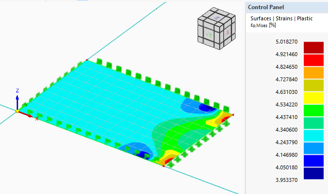
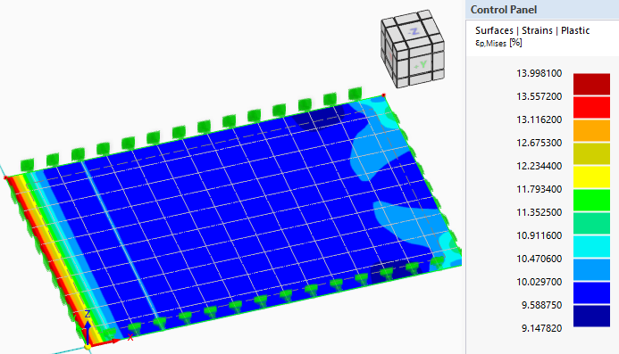
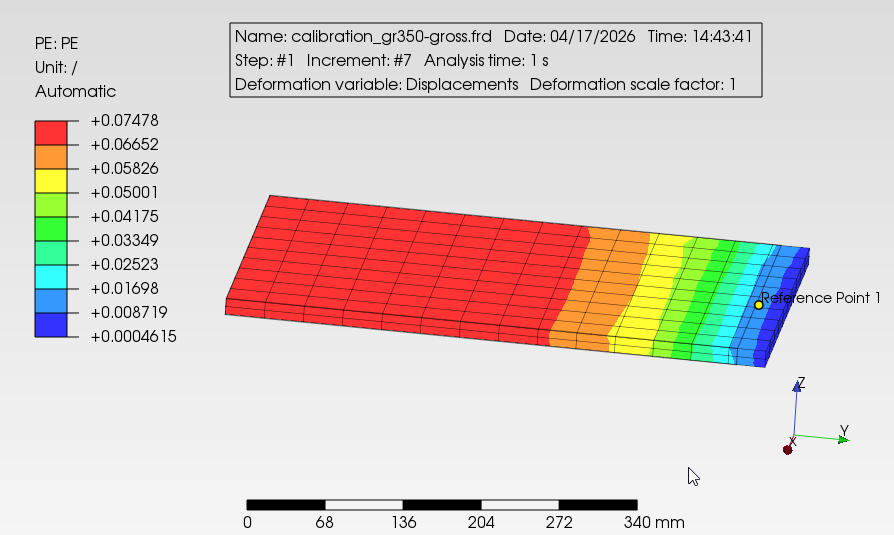
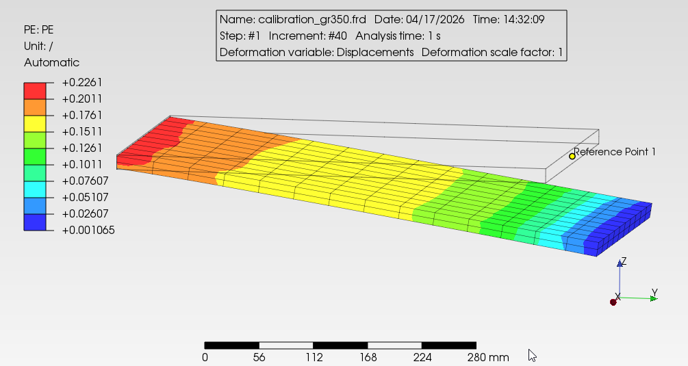

<!-- refer project 25223 yarwun calciner -->

# Plastic strain limit calibration

## Bilinear stress-strain curve

```{julia}
Ep = (243.4MPa - 236.2MPa) / (0.02 - 0.004)  # tangent modulus from table 4-2 of Ref[3]
```

## Gross yield strain, through thickness calibration {#sec-gross-calibration}

According to DNV-RP-C208, the plastic strain limit for steel is to be calibrated according to 5.1.3.2

{#fig-dnv-calibration width="400"}

```{julia}
#| label: dnv-calibration
#| echo: true
t = 15mm # std calibration thickness
l = 30mm # per DNV calibration example length

ϵ_crg = 5.0 / 100 # from figure above

ϵ_crl = ϵ_crg * (1 + 5 * t / 3l)
```

According to RP-C208, the capacity has to have a material partial safety factor of

```{julia}
ϕ = 0.9  # material partial safety factor for steel in AS 4100
γtf = 1.2  # additional safety factor for tensile fracture according to hte procedure per DNV-RP-C208 5.1.3
γM = γtf * 1 / ϕ
```

therefore the allowable plastic strain limit, considering the safety factors is

```{julia}
ϵ_crl_membrane_allow = ϵ_crl / γM
```

This will allow the analysis of the platework to determine the adequacy of the design by direct plot within the software. In addition, the yield zone must be within 20t from the point of maximum plastic strain.

## localized out-of-plane strain calibration

For stresses dominated by out-of-plain bending, the plastic strain limit is to be calibrated according to 5.1.3.3 of DNV-RP-C208.

{width="400"}

Therefore the plastic strain limit for localized out-of-plane bending is

```{julia}
ϵ_crl_surface = 14.77 / 100 # from figure above
ϵ_crl_allow_surface = ϵ_crl_surface / γM
```


# Recent calculation in Amrun including Calculix

# Design Criteria

In general, design shall be to AS 4100 for member design. For finite element plate or solid element analysis, in addition to the requirement of AS 4100, the plastic strain limits shall be limited according to DNV-RP-C208.

The plastic strain limits are discussed in the following sections.  Separate calibration is performed for RFEM plate/shell analysis and Calculix 3D solid finite element analysis.

## Plastic strain limit calibration for AS/NZS 3678 Grade 250 steel for RFEM plate/shell analysis

### Bilinear stress-strain curve (ignore part 4 of post yield-hardening)

![Idealised stress-strain curve, refer Figure 4-5 ref[1]](images/calibration/fig4-5-stress-stain-curve.png)

```{julia}
# tangent modulus from table 4-2 of Ref[1] is only used to get the post yield curve
σ_y = 236.2MPa
σ_y2 = 243.4MPa

Ep = (σ_y2 - σ_y) / (0.02 - 0.004)
```

### Gross yield strain, through thickness calibration {#sec-gross_calibration}

According to DNV-RP-C208, the plastic strain limit for steel is to be calibrated according to 5.1.3.2

{#fig-dnv-calibration width="400"}

```{julia}
#| label: dnv-calibration
#| echo: true
t = 15mm # std calibration thickness
l = 30mm # per DNV calibration example length

ϵ_crg = 5.0 / 100 # from figure above

ϵ_crl = ϵ_crg * (1 + 5 * t / 3l)
```

According to RP-C208, the capacity has to have a material partial safety factor of

   ```{julia}
ϕ = 0.9  # material partial safety factor for steel in AS 4100
γtf = 1.2  # additional safety factor for tensile fracture according to hte procedure per DNV-RP-C208 5.1.3
γM = γtf * 1 / ϕ
```

therefore the allowable plastic strain limit, considering the safety factors is

```{julia}
ϵ_crl_membrane_allow = ϵ_crl / γM
```

This will allow the analysis of the platework to determine the adequacy of the design by direct plot within the software. In addition, the yield zone must be within 20t from the point of maximum plastic strain.

### Localized out-of-plane strain calibration

For stresses dominated by out-of-plain bending, the plastic strain limit is to be calibrated according to 5.1.3.3 of DNV-RP-C208.

{width="400"}

Therefore the plastic strain limit for localized out-of-plane bending is

```{julia}
ϵ_crl_surface = 14.77 / 100 # from figure above
ϵ_crl_allow_surface = ϵ_crl_surface / γM
```

provided the midpoint (membrane) plastic limit is limited per @sec-gross_calibration

## Plastic strain limit calibration for AS/NZS 3678 Grade 350 steel for Calculix 3D solid finite element analysis

### Bilinear stress-strain curve (ignore post yield-hardening)

```{julia}
# tangent modulus from table 4-4 of Ref[1] is only used to get the post yield curve
σ_y = 357MPa
σ_y2 = 366.1MPa

Ep = (σ_y2 - σ_y) / (0.02 - 0.004)  # 
```


### Gross yield strain, through thickness calibration {#sec-gross_calibration_ccx}

According to DNV-RP-C208, the plastic strain limit for steel is to be calibrated according to 5.1.3.2

{ width="400"}

```{julia}
#| label: dnv-calibration
#| echo: true
t = 15mm # std calibration thickness
l = 30mm # per DNV calibration example length

ϵ_crg = 0.07478 # from figure above

ϵ_crl = ϵ_crg * (1 + 5 * t / 3l)
```

According to RP-C208, the capacity has to have a material partial safety factor of

   ```{julia}
ϕ = 0.9  # material partial safety factor for steel in AS 4100
γtf = 1.2  # additional safety factor for tensile fracture according to the procedure per DNV-RP-C208 5.1.3
γM = γtf * 1 / ϕ
```

therefore the allowable plastic strain limit, considering the safety factors is

```{julia}
ϵ_crl_membrane_allow = ϵ_crl / γM
```

### Localized out-of-plane strain calibration

According to DNV-RP-C208, the plastic strain limit for steel is to be calibrated according to 5.1.3.3.

{width="400"}

Therefore the plastic strain limit for localized out-of-plane bending is

```{julia}
ϵ_crl_surface = 0.2261 # from figure above
ϵ_crl_allow_surface = ϵ_crl_surface / γM
```

provided the midpoint (membrane) plastic limit is limited per @sec-gross_calibration_ccx

